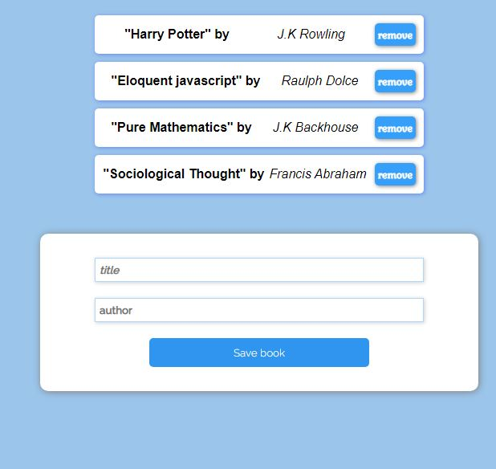

# Awesome Books

> A simple Todo app to add list of books a user has read. It is implemented using JavaScript object and classes. A todo is saved and displayed in Realtime. A todo can be removed from the list of to-dos. Data persistence is implemented using local Storage API

Additional description about the project and its features.

## Built With

- HTML
- CSS
- Webhint
- Stylelint
- Javascript

## Live Demo

[Live Demo Link](https://amedzro-elikplim.github.io/Awesome-books/)

## Getting Started

To get a local copy up and running follow these simple example steps.

### Prerequisites

- Knowledge on basic html and css
- Text Editor (VScode, Atom, Sublime text, etc)
- Basic knowledge of node.js

### Setup

- clone repository using `git clone`
- git clone `https://github.com/Amedzro-Elikplim/Awesome-books.git`
- cd `Awesome-books`.
- run `npm install`
- open `index.html file`

## Author

👤 **Amedzro Elikplim Emmanuel**

- GitHub: [@Amedzro-Elikplim](https://github.com/Amedzro-Elikplim)
- Twitter: [@ElikplimAmedzro](https://twitter.com/Amedzro-Elikplim)
- LinkedIn: [Emmanuel Elikplim Amedzro](https://www.linkedin.com/in/emmanuel-elikplim-amedzro-187590125/)

## 🤝 Contributing

Contributions, issues, and feature requests are welcome!

Feel free to check the [issues page](../../issues/).

## Show your support

Give a ⭐️ if you like this project!

## 📝 License

This project is [MIT](./LICENSE) licensed.